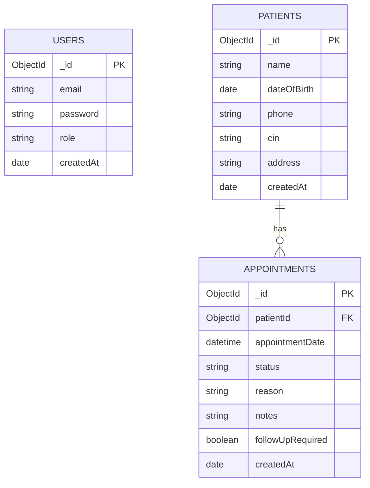
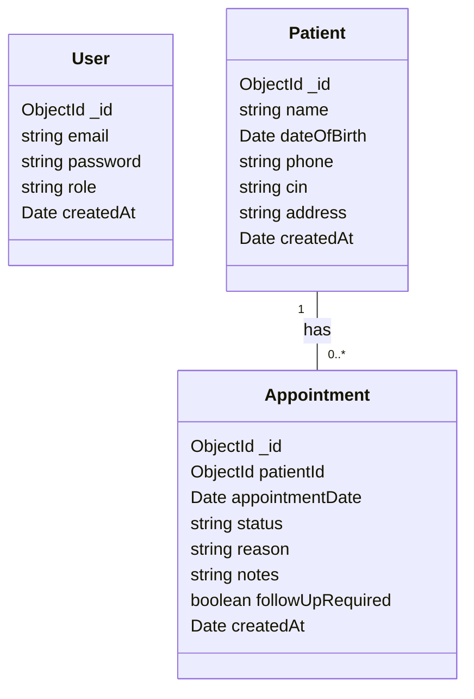

# Test Technique Tython

Application full-stack avec un backend Node.js/Express/MongoDB et un frontend React/Vite.

## Prerequisites

- Node.js 18+ recommended
- MongoDB running locally or a MongoDB Atlas connection string

## Project Structure

- `backend/` API Express + Mongoose
- `frontend/` UI React + Vite

```mermaid
flowchart LR
	subgraph Frontend
		FE[React + Vite]
		AuthCtx[AuthContext\n(localStorage token)]
	end
	subgraph Backend
		BE[Node.js + Express]
		Controllers[Controllers]
		Models[Mongoose\nModels]
	end
	DB[(MongoDB)]

	FE -->|API requests (JSON)| BE
	AuthCtx --> FE
	BE -->|reads / writes| DB
	BE --> Controllers
	Controllers --> Models

```



Notes:
- Auth via `POST /api/auth/login` returns a JWT stored in `localStorage`.
- `users.email` should be unique; consider indexes on `appointments.appointmentDate` and `appointments.status` for query performance.

```mermaid
graph TD
	subgraph Client[Frontend]
		A[Browser\nReact + Vite]
		A -->|HTTP JSON| B[API Server\nNode.js + Express]
		A -->|stores token| L[localStorage]
	end
	subgraph Server[Backend]
		B --> C[Routing / Middleware]
		C --> D[Controllers]
		D --> E[Services / Validators]
		E --> F[Mongoose Models]
	end
	F -->|persist| G[(MongoDB)]
	A -.->|Authorization header (Bearer JWT)| B
	B -->|exposes| H[/api/auth, /api/patients, /api/appointments]

```



## Installation

### 1) Backend

```bash
cd backend
npm install
```

### 2) Frontend

```bash
cd frontend
npm install
```

## Environment Variables

### Backend

Create `backend/.env` from `backend/.env.example`.

Example:

```env
MONGODB_URI=mongodb://localhost:27017/test-technique-tython
PORT=5000
JWT_SECRET=change_this_secret
CORS_ORIGIN=http://localhost:5173
NODE_ENV=development
```

### Frontend

Create `frontend/.env.local` only if you want to override the API URL.

Example:

```env
VITE_API_URL=http://localhost:5000/api
```

If `VITE_API_URL` is not set, the frontend uses `http://localhost:5000/api` by default.

## Commands

### Backend

```bash
cd backend
npm run dev      # Start the API with nodemon
npm start        # Start the API with node
npm run seed     # Seed admin, staff, patients, and appointments
```

### Frontend

```bash
cd frontend
npm run dev      # Start the Vite dev server
npm run build    # Build for production
npm run preview  # Preview the production build
npm run lint     # Run ESLint
```

## Seed Data

The seed script creates:

- 1 admin user
- 2 staff users
- 5 patients
- 10 appointments with mixed `pending`, `confirmed`, and `cancelled` statuses

Default seeded users:

- `admin@example.com` / `Admin12345!`
- `staff1@example.com` / `Staff12345!`
- `staff2@example.com` / `Staff12345!`

## API Routes

### Auth

- `POST /api/auth/login`
- `GET /api/auth/me`

### Patients

- `POST /api/patients`
- `GET /api/patients?search=&page=&limit=`
- `GET /api/patients/:id`
- `PUT /api/patients/:id`
- `DELETE /api/patients/:id` (admin)

### Appointments

- `POST /api/appointments`
- `GET /api/appointments?date=&status=`
- `PATCH /api/appointments/:id/status`

## Run Locally

1. Start MongoDB.
2. Start the backend with `npm run dev` inside `backend/`.
3. Start the frontend with `npm run dev` inside `frontend/`.
4. Open the Vite URL shown in the terminal.

## Notes

- The backend uses JWT authentication.
- The frontend stores the token in `localStorage`.
- If you use Windows PowerShell and `npm` is blocked, run `npm.cmd` instead.

**Creator Relations**

- `Patient` and `Appointment` now include a `createdBy` field referencing the `User` who created the record.
- Implementation details:
	- `Patient.createdBy`: ObjectId -> `users` (required). Set automatically from `req.user._id` in `POST /api/patients` (staff/admin only).
	- `Appointment.createdBy`: ObjectId -> `users` (required). Set automatically from `req.user._id` in `POST /api/appointments` (staff/admin only) and during seeding the admin user is used.
	- Controllers prevent overwriting `createdBy` on update requests.
- Seed script (`backend/seed.js`) now attaches the admin user as `createdBy` for seeded patients and appointments so seeding remains compatible with the new required fields.
- Business rule reminders:
	- A patient cannot have another confirmed appointment within 30 minutes earlier; attempting to create or confirm such an appointment returns HTTP 400.

